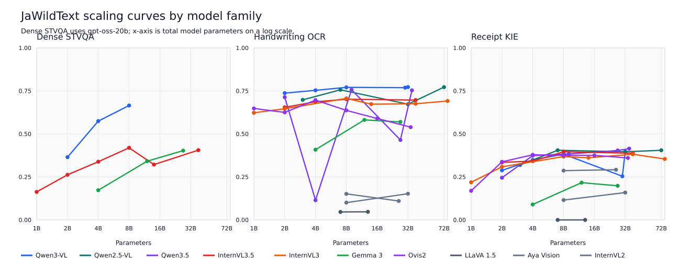

# Extended Results

Generated at: `2026-06-01T00:30:41+00:00`

This page documents extended JaWildText aggregate results beyond the 14-model main-paper table.
Dense STVQA scores in these artifacts use `openai/gpt-oss-20b` with `reasoning_effort=low` as the public verifier.
Handwriting OCR and Receipt KIE use the standard task scorers.

## Artifacts

- `results/extended_leaderboard_gptoss.md`: full aggregate table.
- `results/extended_leaderboard_gptoss.json`: machine-readable rows with source roots.
- `results/family_summary_gptoss.md`: model-family summary.
- `results/family_summary_gptoss.json`: machine-readable family summary.
- `results/scaling_curves/by_task_and_family.svg`: scaling-curve plot.
- `results/scaling_curves/by_task_and_family.png`: rendered scaling-curve image.
- `results/scaling_curves/by_task_and_family.json`: plot source data.

## Coverage

| Artifact | Rows |
| :--- | ---: |
| Models with at least one JaWildText aggregate score | 56 |
| Models with all three task scores in this export | 13 |
| Dense STVQA gpt-oss aggregate scores | 17 |
| Handwriting OCR aggregate scores | 52 |
| Receipt KIE aggregate scores | 52 |

## Scaling Curves

The plotted image emphasizes multi-size families with at least two parameter points.
The JSON artifact contains all task-family points used for the plot.

## Provenance

| Task | Result root | Metric |
| :--- | :--- | :--- |
| Dense STVQA | jawildtext-board-vqa-gptoss | accuracy |
| Handwriting OCR | jawildtext-handwriting-ocr | 1 - CER |
| Receipt KIE | jawildtext-receipt-kie | field/value F1 |

`jawildtext-board-vqa-gpt51` is not used for the public Dense STVQA column in these artifacts.
Raw prediction files and run logs are intentionally excluded.
