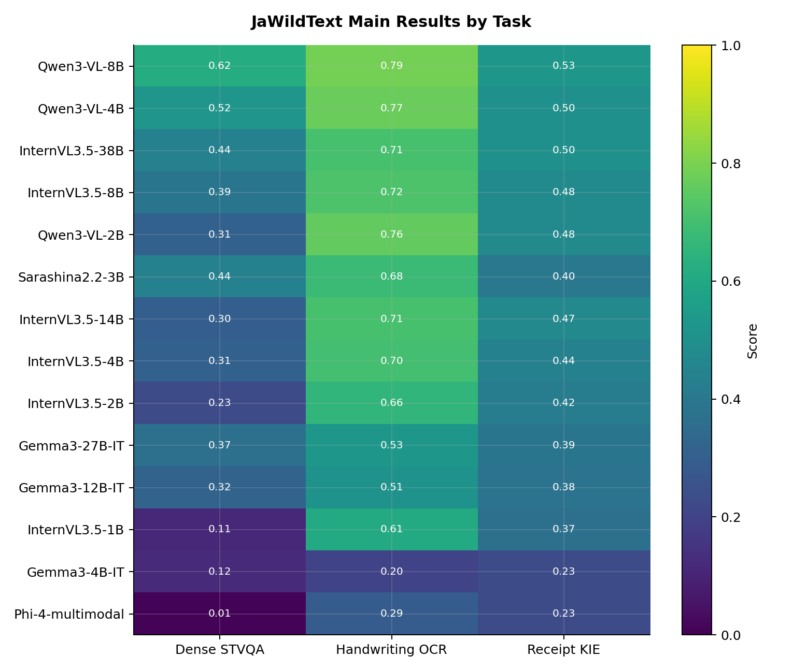
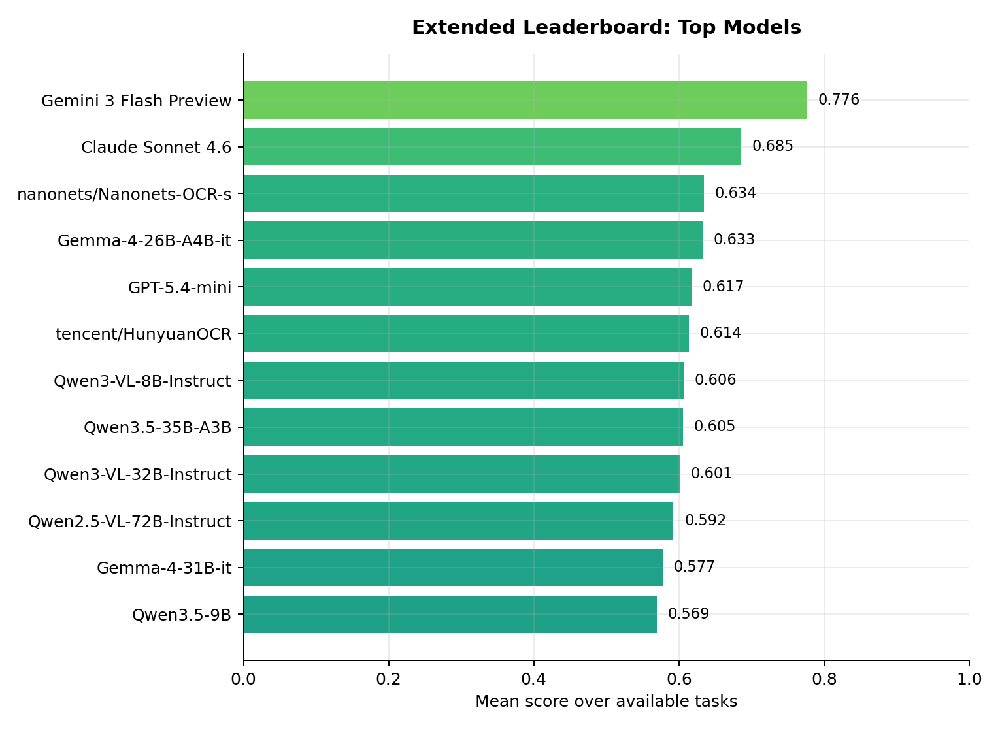

# Leaderboard

This page collects public JaWildText result tables and visual summaries.
The layout is designed to mirror common evaluation pages: task definitions, model coverage, aggregate tables, and task-wise visual comparisons are kept close together.

## Main Paper Table

The main table covers the 14-model set used in the JaWildText paper.

| Model | Params | Overall | Dense STVQA | Handwriting OCR | Receipt KIE |
| :--- | ---: | ---: | ---: | ---: | ---: |
| Qwen3-VL-8B | 8B | 0.640 | 0.620 | 0.790 | 0.530 |
| Qwen3-VL-4B | 4B | 0.600 | 0.520 | 0.770 | 0.500 |
| InternVL3.5-38B | 38B | 0.550 | 0.440 | 0.710 | 0.500 |
| InternVL3.5-8B | 8B | 0.530 | 0.390 | 0.720 | 0.480 |
| Qwen3-VL-2B | 2B | 0.520 | 0.310 | 0.760 | 0.480 |
| Sarashina2.2-3B | 3B | 0.500 | 0.440 | 0.680 | 0.400 |
| InternVL3.5-14B | 14B | 0.490 | 0.300 | 0.710 | 0.470 |
| InternVL3.5-4B | 4B | 0.480 | 0.310 | 0.700 | 0.440 |
| InternVL3.5-2B | 2B | 0.440 | 0.230 | 0.660 | 0.420 |
| Gemma3-27B-IT | 27B | 0.430 | 0.370 | 0.530 | 0.390 |
| Gemma3-12B-IT | 12B | 0.400 | 0.320 | 0.510 | 0.380 |
| InternVL3.5-1B | 1B | 0.370 | 0.110 | 0.610 | 0.370 |
| Gemma3-4B-IT | 4B | 0.190 | 0.120 | 0.200 | 0.230 |
| Phi-4-multimodal | 14B | 0.180 | 0.008 | 0.290 | 0.230 |

## Extended Leaderboard

The extended leaderboard uses `jawildtext-board-vqa-gptoss` for the Dense STVQA column, with `openai/gpt-oss-20b` as the verifier.
It is intentionally kept separate from the main-paper Dense STVQA setting.

| Rank | Model | Family | Mean | Dense STVQA | Handwriting OCR | Receipt KIE |
| :---: | :--- | :--- | ---: | ---: | ---: | ---: |
| 1 | Gemini 3 Flash Preview | Closed | 0.776 | 0.889 | 0.772 | 0.667 |
| 2 | Claude Sonnet 4.6 | Closed | 0.685 | 0.768 | 0.696 | 0.592 |
| 3 | nanonets/Nanonets-OCR-s | nanonets | 0.634 | -- | 0.634 | -- |
| 4 | Gemma-4-26B-A4B-it | google | 0.633 | 0.538 | 0.728 | -- |
| 5 | GPT-5.4-mini | Closed | 0.617 | 0.500 | 0.750 | 0.603 |
| 6 | tencent/HunyuanOCR | tencent | 0.614 | -- | 0.614 | -- |
| 7 | Qwen3-VL-8B-Instruct | Qwen3-VL | 0.606 | 0.665 | 0.771 | 0.383 |
| 8 | Qwen3.5-35B-A3B | Qwen3.5 | 0.605 | 0.648 | 0.754 | 0.415 |
| 9 | Qwen3-VL-32B-Instruct | Qwen3-VL | 0.601 | 0.633 | 0.772 | 0.397 |
| 10 | Qwen2.5-VL-72B-Instruct | Qwen2.5-VL | 0.592 | 0.600 | 0.772 | 0.405 |
| 11 | Gemma-4-31B-it | google | 0.577 | 0.609 | 0.721 | 0.402 |
| 12 | Qwen3.5-9B | Qwen3.5 | 0.569 | 0.568 | 0.757 | 0.384 |
| 13 | Qwen3-VL-4B-Instruct | Qwen3-VL | 0.559 | 0.575 | 0.754 | 0.349 |
| 14 | Qwen2-VL-72B-Instruct | Qwen2-VL | 0.537 | 0.448 | 0.743 | 0.420 |
| 15 | Qwen2.5-VL-7B-Instruct | Qwen2.5-VL | 0.528 | 0.422 | 0.757 | 0.405 |
| 16 | Qwen3-VL-30B-A3B-Instruct | Qwen3-VL | 0.526 | 0.554 | 0.769 | 0.254 |
| 17 | sbintuitions/sarashina2.2-ocr | Sarashina2.2 | 0.516 | -- | 0.516 | -- |
| 18 | InternVL3-78B | InternVL3 | 0.516 | 0.502 | 0.692 | 0.354 |
| 19 | Qwen2.5-VL-32B-Instruct | Qwen2.5-VL | 0.511 | 0.465 | 0.673 | 0.396 |
| 20 | InternVL3-38B | InternVL3 | 0.507 | 0.464 | 0.676 | 0.382 |
| 21 | InternVL3.5-8B | InternVL3.5 | 0.506 | 0.420 | 0.702 | 0.396 |
| 22 | InternVL3.5-38B | InternVL3.5 | 0.497 | 0.406 | 0.697 | 0.387 |
| 23 | InternVL3-14B | InternVL3 | 0.489 | 0.432 | 0.673 | 0.361 |
| 24 | InternVL3-8B | InternVL3 | 0.484 | 0.379 | 0.707 | 0.368 |
| 25 | AIDC-AI/Ovis2-4B | Ovis2 | 0.481 | 0.369 | 0.697 | 0.379 |
| 26 | Qwen3.5-27B | Qwen3.5 | 0.478 | 0.565 | 0.465 | 0.403 |
| 27 | AIDC-AI/Ovis2-8B | Ovis2 | 0.469 | 0.394 | 0.637 | 0.376 |
| 28 | AIDC-AI/Ovis2-16B | Ovis2 | 0.468 | 0.439 | 0.590 | 0.375 |
| 29 | Sarashina2.2-Vision-3b | Sarashina2.2 | 0.467 | 0.467 | -- | -- |
| 30 | Qwen3-VL-2B-Instruct | Qwen3-VL | 0.464 | 0.365 | 0.737 | 0.288 |
| 31 | Qwen2-VL-7B-Instruct | Qwen2-VL | 0.462 | 0.279 | 0.711 | 0.397 |
| 32 | InternVL3.5-4B | InternVL3.5 | 0.456 | 0.339 | 0.687 | 0.342 |
| 33 | AIDC-AI/Ovis2-34B | Ovis2 | 0.450 | 0.450 | 0.540 | 0.360 |
| 34 | Gemma-4-E4B-it | google | 0.421 | 0.308 | 0.685 | 0.270 |
| 35 | Qwen3.5-2B | Qwen3.5 | 0.418 | 0.296 | 0.714 | 0.246 |
| 36 | InternVL3.5-2B | InternVL3.5 | 0.417 | 0.262 | 0.655 | 0.335 |
| 37 | Qwen2.5-VL-3B-Instruct | Qwen2.5-VL | 0.416 | 0.231 | 0.698 | 0.319 |
| 38 | moonshotai/Kimi-VL-A3B-Instruct | Kimi-VL | 0.409 | 0.296 | 0.527 | 0.403 |
| 39 | openbmb/MiniCPM-o-2_6 | MiniCPM | 0.404 | 0.319 | 0.565 | 0.327 |
| 40 | AIDC-AI/Ovis2-2B | Ovis2 | 0.402 | 0.243 | 0.625 | 0.338 |
| 41 | Gemma-3-27b-it | Gemma 3 | 0.390 | 0.403 | 0.570 | 0.198 |
| 42 | mistralai/Mistral-Small-3.1-24B-Instruct-2503 | mistralai | 0.385 | 0.492 | 0.366 | 0.296 |
| 43 | InternVL3-2B | InternVL3 | 0.384 | 0.197 | 0.646 | 0.309 |
| 44 | Gemma-3-12b-it | Gemma 3 | 0.380 | 0.341 | 0.582 | 0.217 |
| 45 | Qwen2-VL-2B-Instruct | Qwen2-VL | 0.376 | 0.144 | 0.675 | 0.308 |
| 46 | sbintuitions/sarashina2-vision-14b | Sarashina2 | 0.365 | 0.222 | 0.635 | 0.237 |
| 47 | Gemma-4-E2B-it | google | 0.361 | 0.203 | 0.618 | 0.262 |
| 48 | InternVL3.5-1B | InternVL3.5 | 0.358 | 0.163 | 0.613 | 0.298 |
| 49 | AIDC-AI/Ovis2-1B | Ovis2 | 0.328 | 0.166 | 0.648 | 0.169 |
| 50 | InternVL3-1B | InternVL3 | 0.327 | 0.140 | 0.623 | 0.219 |
| 51 | InternVL3.5-14B | InternVL3.5 | 0.322 | 0.322 | -- | -- |
| 52 | nvidia/nemotron-ocr-v2 | nvidia | 0.318 | -- | 0.318 | -- |
| 53 | Qwen3.5-4B | Qwen3.5 | 0.299 | 0.408 | 0.115 | 0.374 |
| 54 | AIDC-AI/Ovis2.5-2B | Ovis2.5 | 0.299 | 0.354 | 0.542 | 0.000 |
| 55 | AIDC-AI/Ovis2.5-9B | Ovis2.5 | 0.272 | 0.458 | 0.359 | 0.000 |
| 56 | sbintuitions/sarashina2-vision-8b | Sarashina2 | 0.262 | 0.176 | 0.503 | 0.106 |
| 57 | Gemma-3-4b-it | Gemma 3 | 0.224 | 0.173 | 0.408 | 0.090 |
| 58 | InternVL2-8B | InternVL2 | 0.222 | 0.227 | 0.152 | 0.287 |
| 59 | turing-motors/Heron-NVILA-Lite-15B | turing-motors | 0.197 | 0.175 | 0.324 | 0.091 |
| 60 | InternVL2-26B | InternVL2 | 0.191 | 0.173 | 0.110 | 0.292 |
| 61 | CohereLabs/aya-vision-32b | Aya Vision | 0.187 | 0.249 | 0.152 | 0.159 |
| 62 | Phi-4-multimodal | Phi-4 | 0.167 | 0.167 | -- | -- |
| 63 | allenai/Molmo2-8B | Molmo2 | 0.145 | 0.165 | 0.062 | 0.208 |
| 64 | turing-motors/Heron-NVILA-Lite-2B | turing-motors | 0.127 | 0.116 | 0.223 | 0.041 |
| 65 | allenai/Molmo2-4B | Molmo2 | 0.120 | 0.134 | 0.061 | 0.167 |
| 66 | CohereLabs/aya-vision-8b | Aya Vision | 0.120 | 0.144 | 0.101 | 0.115 |
| 67 | mistralai/Pixtral-12B-2409 | mistralai | 0.094 | 0.164 | 0.030 | 0.087 |
| 68 | neulab/Pangea-7B-hf | Pangea | 0.090 | 0.134 | 0.021 | 0.115 |
| 69 | meta-llama/Llama-3.2-11B-Vision-Instruct | Llama 3.2 Vision | 0.080 | 0.169 | 0.065 | 0.008 |
| 70 | cyberagent/llava-calm2-siglip | cyberagent | 0.051 | 0.110 | 0.016 | 0.027 |
| 71 | llava-hf/llava-1.5-13b-hf | LLaVA 1.5 | 0.029 | 0.041 | 0.047 | 0.000 |
| 72 | llava-hf/llava-v1.6-mistral-7b-hf | LLaVA 1.6 | 0.029 | 0.043 | 0.002 | 0.043 |
| 73 | stabilityai/japanese-stable-vlm | stabilityai | 0.029 | 0.060 | 0.027 | 0.000 |
| 74 | llava-hf/llava-1.5-7b-hf | LLaVA 1.5 | 0.028 | 0.039 | 0.046 | 0.000 |
| 75 | stabilityai/japanese-instructblip-alpha | stabilityai | 0.016 | 0.045 | 0.002 | 0.000 |
| 76 | MIL-UT/Asagi-14B | MIL-UT | 0.010 | 0.015 | 0.017 | 0.000 |

Full machine-readable rows are available in [`results/extended_leaderboard_gptoss.json`](https://github.com/llm-jp/jawildtext/blob/main/results/extended_leaderboard_gptoss.json).

## Coverage

| Coverage item | Models |
| :--- | ---: |
| Dense STVQA | 72 |
| Handwriting OCR | 73 |
| Receipt KIE | 68 |
| Any JaWildText aggregate score | 76 |
