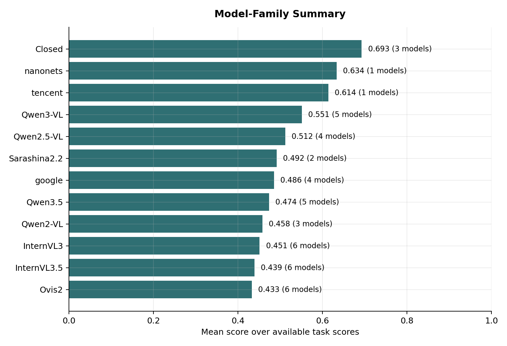

# Leaderboard

This page collects public JaWildText result tables and visual summaries.
The layout is designed to mirror common evaluation pages: task definitions, model coverage, aggregate tables, and task-wise visual comparisons are kept close together.

## Main Paper Table

The main table covers the 14-model set used in the JaWildText paper.

| Model | Params | Overall | Dense STVQA | Handwriting OCR | Receipt KIE |
| :--- | ---: | ---: | ---: | ---: | ---: |
| Qwen3-VL-8B | 8B | 0.640 | 0.620 | 0.790 | 0.530 |
| Qwen3-VL-4B | 4B | 0.600 | 0.520 | 0.770 | 0.500 |
| InternVL3.5-38B | 38B | 0.550 | 0.440 | 0.710 | 0.500 |
| InternVL3.5-8B | 8B | 0.530 | 0.390 | 0.720 | 0.480 |
| Qwen3-VL-2B | 2B | 0.520 | 0.310 | 0.760 | 0.480 |
| Sarashina2.2-3B | 3B | 0.500 | 0.440 | 0.680 | 0.400 |
| InternVL3.5-14B | 14B | 0.490 | 0.300 | 0.710 | 0.470 |
| InternVL3.5-4B | 4B | 0.480 | 0.310 | 0.700 | 0.440 |
| InternVL3.5-2B | 2B | 0.440 | 0.230 | 0.660 | 0.420 |
| Gemma3-27B-IT | 27B | 0.430 | 0.370 | 0.530 | 0.390 |
| Gemma3-12B-IT | 12B | 0.400 | 0.320 | 0.510 | 0.380 |
| InternVL3.5-1B | 1B | 0.370 | 0.110 | 0.610 | 0.370 |
| Gemma3-4B-IT | 4B | 0.190 | 0.120 | 0.200 | 0.230 |
| Phi-4-multimodal | 14B | 0.180 | 0.008 | 0.290 | 0.230 |

## Extended Leaderboard

The extended leaderboard uses `jawildtext-board-vqa-gptoss` for the Dense STVQA column, with `openai/gpt-oss-20b` as the verifier.
It is intentionally kept separate from the main-paper Dense STVQA setting.

| Rank | Model | Family | Mean | Dense STVQA | Handwriting OCR | Receipt KIE |
| :---: | :--- | :--- | ---: | ---: | ---: | ---: |
| 1 | Gemini 3 Flash Preview | Closed | 0.776 | 0.889 | 0.772 | 0.667 |
| 2 | Claude Sonnet 4.6 | Closed | 0.685 | 0.768 | 0.696 | 0.592 |
| 3 | nanonets/Nanonets-OCR-s | nanonets | 0.634 | -- | 0.634 | -- |
| 4 | Gemma-4-26B-A4B-it | google | 0.633 | 0.538 | 0.728 | -- |
| 5 | GPT-5.4-mini | Closed | 0.617 | 0.500 | 0.750 | 0.603 |
| 6 | tencent/HunyuanOCR | tencent | 0.614 | -- | 0.614 | -- |
| 7 | Qwen3-VL-8B-Instruct | Qwen3-VL | 0.606 | 0.665 | 0.771 | 0.383 |
| 8 | Qwen3.5-35B-A3B | Qwen3.5 | 0.605 | 0.648 | 0.754 | 0.415 |
| 9 | Qwen3-VL-32B-Instruct | Qwen3-VL | 0.601 | 0.633 | 0.772 | 0.397 |
| 10 | Qwen2.5-VL-72B-Instruct | Qwen2.5-VL | 0.592 | 0.600 | 0.772 | 0.405 |
| 11 | Gemma-4-31B-it | google | 0.577 | 0.609 | 0.721 | 0.402 |
| 12 | Qwen3.5-9B | Qwen3.5 | 0.569 | 0.568 | 0.757 | 0.384 |
| 13 | Qwen3-VL-4B-Instruct | Qwen3-VL | 0.559 | 0.575 | 0.754 | 0.349 |
| 14 | Qwen2-VL-72B-Instruct | Qwen2-VL | 0.537 | 0.448 | 0.743 | 0.420 |
| 15 | Qwen2.5-VL-7B-Instruct | Qwen2.5-VL | 0.528 | 0.422 | 0.757 | 0.405 |
| 16 | Qwen3-VL-30B-A3B-Instruct | Qwen3-VL | 0.526 | 0.554 | 0.769 | 0.254 |
| 17 | sbintuitions/sarashina2.2-ocr | Sarashina2.2 | 0.516 | -- | 0.516 | -- |
| 18 | InternVL3-78B | InternVL3 | 0.516 | 0.502 | 0.692 | 0.354 |
| 19 | Qwen2.5-VL-32B-Instruct | Qwen2.5-VL | 0.511 | 0.465 | 0.673 | 0.396 |
| 20 | InternVL3-38B | InternVL3 | 0.507 | 0.464 | 0.676 | 0.382 |

Full machine-readable rows are available in [`results/extended_leaderboard_gptoss.json`](https://github.com/llm-jp/jawildtext/blob/main/results/extended_leaderboard_gptoss.json).

## Coverage

| Coverage item | Models |
| :--- | ---: |
| Dense STVQA | 72 |
| Handwriting OCR | 73 |
| Receipt KIE | 68 |
| Any JaWildText aggregate score | 76 |

## Family View

